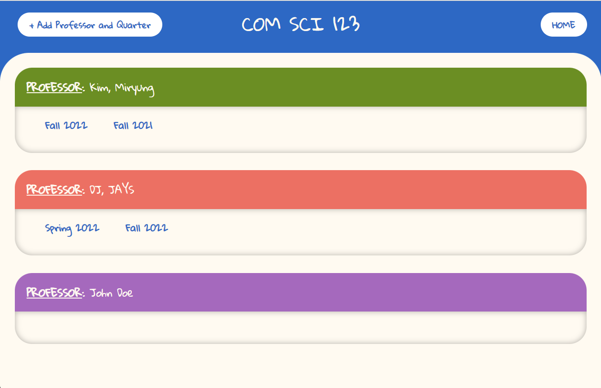

# Account System Unit Test

## Test 1 - Invalidating User Inputs

**Objective**: To check whether the user input validation is working correctly on the edge cases

### Full Name

**Objective**: To check whether the validation of user's full name correctly identified when the user enter Invalid Name without a first or last name.

**Code**:
```json 
[function validateFullName() {
        var namePattern = new RegExp("[A-Za-z]+ [A-Za-z]+");
        if (!fullname.match(namePattern)) {
            return false;
        }
        return true;
    }
]
```

**Possible Path**: 2

**Input**: 

**Outcome**: 

<br>

## Test 2 - Invali

**Objective**: to check whether the page can properly display the edge case of an empty sublist in the `terms` field of our data. The corresponding `div` should only show the professor.  

**Input**: 
```json
[{
    "instructor": "Kim, Miryung",
    "terms": ["Fall 2022", "Fall 2021"],
    "colorCode": 1,
  }, {
    "instructor": "DJ, JAYS",
    "terms": ["Spring 2022", "Fall 2022"],
    "colorCode": 2,
  }, {
    "instructor": "John Doe", 
    "terms": [],
    "colorCode": 3,
}]
```

**Outcome**: 

<figcaption align="center">The professor John Doe has no quarter associated to it </figcaption>

<br>

